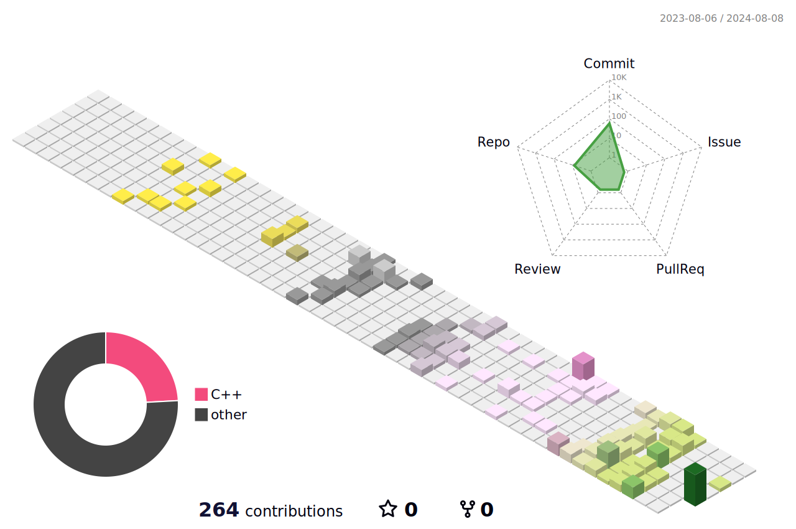

<h1 align="center">Hi 👋, I'm Ly Bin</h1>

  

  

- 🌱 I’m currently learning **C++、OpenCV、DL**

- 📫 How to reach me **lybin1336258176@outlook.com**

&nbsp;

<h3 align="left">Connect with me:</h3>

<h3 align="left">Languages and Tools:</h3>

          

